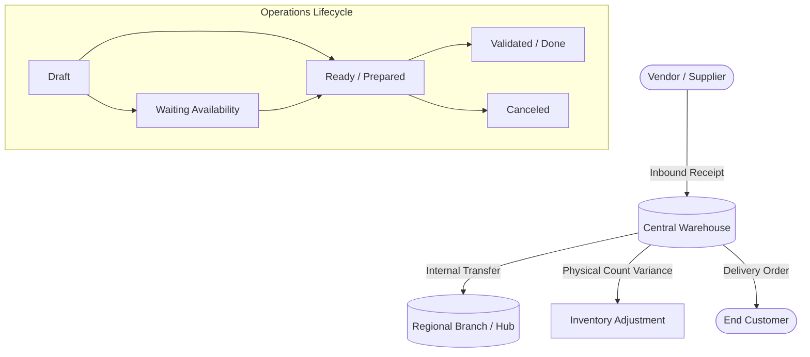

# StockSense 📦

> **Next-Generation Inventory Management System (IMS)**  
> An enterprise-grade platform to digitize warehouse operations, streamline supply chain movements, and eliminate manual stock discrepancies.

[](https://nextjs.org/)
[](https://react.dev/)
[](https://www.typescriptlang.org/)
[](https://tailwindcss.com/)
[](LICENSE)

---

## 📌 Overview

**StockSense** is an enterprise-grade, real-time inventory management platform inspired by modular enterprise ERP architectures. It replaces error-prone spreadsheets and manual ledgers with an automated, auditable digital workflow covering the entire stock lifecycle—from vendor procurement to warehouse fulfillment.

---

## 🚀 Key Features

### 📊 1. Real-Time Analytics Dashboard
- **Live Stock Valuation**: Instant calculation of total asset value across all storage locations.
- **Stock Health Indicators**: Automated flags for Low Stock, Out-of-Stock, and Overstocked SKUs.
- **Activity Timeline**: Full audit log of all inbound, outbound, and internal movements.
- **Warehouse Facility Filter**: Multi-warehouse dropdown to isolate stock and metrics by facility.

### 🏷️ 2. Product & SKU Catalog with Reordering Rules
- **Master Data Management**: Centralized records with SKU, Barcode, Category, and Unit of Measure (UoM).
- **Automated Reordering Rules**: Configurable minimum/maximum stock rules triggering procurement notifications.
- **SKU Metadata Editor**: In-place editor to update unit cost, reorder thresholds, and bin locations.
- **Cost & Price Tracking**: Dual currency support (₹ INR / $ USD) with live conversions.

### 📥 3. Inbound Receipts (Vendor Stock-In)
- **Supplier Receipts**: Track goods received against purchase orders.
- **State Flow**: `Draft` ➔ `Waiting` ➔ `Ready` ➔ `Done` / `Canceled`.
- **Automatic Stock Increment**: Validating incoming receipts immediately updates quantity and logs to the ledger.

### 📤 4. Outbound Delivery Orders (Stock-Out)
- **Customer Fulfillment**: Pick, pack, and ship workflows for outgoing orders.
- **Stock Availability Guard**: Prevents phantom negative inventory by holding orders in `Waiting Availability` if stock is insufficient.
- **Automatic Stock Reservation**: Deducts stock only upon verified dispatch.

### 🔄 5. Internal Transfers & Real-Time Location Tracking
- **Multi-Location Routing**: Move items between aisles, storage racks, and production lines.
- **Live Shelf Locator**: Updating a transfer automatically moves the product's active storage location in the master catalog.
- **Count Invariance**: Global company inventory remains balanced while rack locations update.

### ⚖️ 6. Physical Stock Adjustments (Audits & Cycle Counts)
- **Discrepancy Reconciliation**: Compare recorded digital numbers against physical floor counts.
- **Shrinkage & Damage Reason Codes**: Log variances with reason tags (`Damaged`, `Stolen`, `Count Error`).
- **One-Click Ledger Sync**: Rebalance stock with an immutable audit entry.

### 📜 7. Immutable Central Stock Ledger (Move History)
- **Double-Entry Traceability**: Comprehensive move history recording every movement with operator, timestamp, and reference code.
- **Audit-Ready Logs**: Filterable timeline of all historical inventory transactions.

### 🌐 8. Universal Light/Dark Theme & Public Landing Portal
- **High-Contrast Theme Engine**: Fluid Dark and Light mode toggle with zero input glare.
- **Public Landing Page**: Default showcase portal explaining system capabilities with 1-click team authentication.

---

## 🏗️ System Workflow



---

## 💻 Tech Stack

| Domain | Technology |
|---|---|
| **Framework** | [Next.js 16](https://nextjs.org/) (App Router) |
| **Frontend Library** | [React 19](https://react.dev/) |
| **Language** | [TypeScript](https://www.typescriptlang.org/) |
| **Styling** | [Tailwind CSS v4](https://tailwindcss.com/) |
| **Icons** | [Lucide React](https://lucide.dev/) |
| **State Management** | React Client State & Context API |
| **Version Control** | Git & GitHub |

---

## 📁 Project Structure

```text
StockSense/
├── public/                 # Static assets, logos, and icons
├── src/
│   ├── app/                # Next.js App Router (pages & layouts)
│   │   ├── layout.tsx      # Root application layout with theme context
│   │   ├── page.tsx        # Role-based Dashboard & Public Landing gate
│   │   └── globals.css     # Global styles & Tailwind CSS tokens
│   ├── components/         # Reusable UI components & modals
│   │   ├── LandingPage.tsx          # Public marketing & feature overview
│   │   ├── AuthModal.tsx            # Login, registration, and OTP verification
│   │   ├── StaffDashboardView.tsx   # Floor staff operational cockpit
│   │   ├── KPICards.tsx             # Live valuation & stock status KPIs
│   │   ├── ProductTable.tsx         # SKU catalog with search and filters
│   │   ├── EditProductModal.tsx     # SKU editor & reorder rules modal
│   │   ├── AddProductModal.tsx      # New SKU creation modal
│   │   ├── OperationsView.tsx       # Receipts, deliveries, and transfers
│   │   ├── StockAdjustmentView.tsx  # Physical counting & discrepancy reconciliation
│   │   ├── StockLedgerView.tsx      # Double-entry audit move history
│   │   ├── WarehouseSettingsView.tsx# Locations, warehouses & user access
│   │   ├── Sidebar.tsx              # Role-aware navigation & theme controls
│   │   └── Navbar.tsx               # Top search bar & profile status
│   ├── context/
│   │   └── ThemeContext.tsx         # Light / Dark theme management
│   ├── data/
│   │   └── mockData.ts              # Master catalog & transaction state
│   ├── types/
│   │   └── inventory.ts             # Domain models & TypeScript interfaces
│   └── utils/
│       └── formatters.ts            # Currency formatter (INR ₹ / USD $)
├── package.json            # Project dependencies and scripts
├── tsconfig.json           # TypeScript configuration
└── README.md               # Project documentation
```

---

## ⚙️ Getting Started

### Prerequisites
- **Node.js**: v18.18.0 or higher (v20+ recommended)
- **npm**: v9 or higher

### Installation

1. **Clone the repository:**
   ```bash
   git clone https://github.com/samad3107/StockSense.git
   cd StockSense
   ```

2. **Install dependencies:**
   ```bash
   npm install
   ```

3. **Start the local development server:**
   ```bash
   npm run dev
   ```

4. **Open in browser:**
   Navigate to [http://localhost:3000](http://localhost:3000) to view the application.

---

## 👥 Team Contribution Guidelines

1. **Create your feature branch:**
   ```bash
   git checkout -b feature/your-feature-name
   ```
2. **Commit your changes:**
   ```bash
   git add .
   git commit -m "feat: implement your feature"
   ```
3. **Push to the branch:**
   ```bash
   git push -u origin feature/your-feature-name
   ```
4. **Open a Pull Request:**
   Submit a PR against the `main` branch with a clear description of your contribution.

---

## 📄 License

This project is licensed under the MIT License.