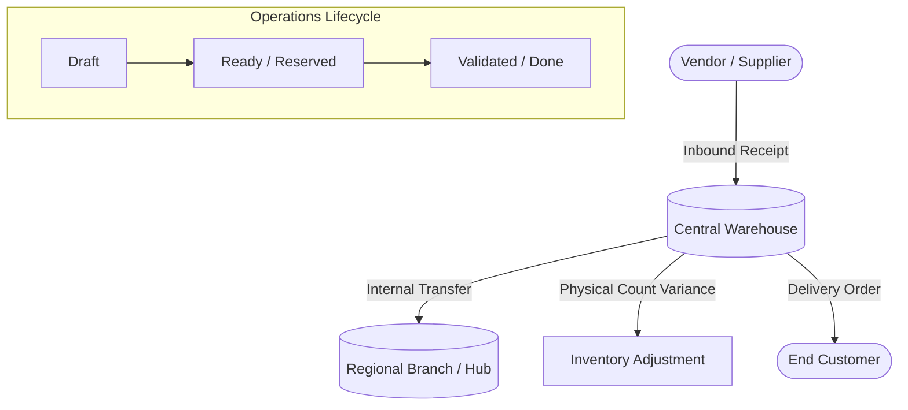

# StockSense 📦

> **Next-Generation Inventory Management System (IMS)**  
> Built for the **Odoo Hackathon** to digitize warehouse operations, streamline supply chain movements, and eliminate manual stock discrepancies.

[](https://nextjs.org/)
[](https://react.dev/)
[](https://www.typescriptlang.org/)
[](https://tailwindcss.com/)
[](LICENSE)

---

## 📌 Overview

**StockSense** is an enterprise-grade, real-time inventory management platform inspired by the modular efficiency of **Odoo ERP**. It replaces error-prone spreadsheets and manual ledgers with an automated, auditable digital workflow covering the entire stock lifecycle—from vendor procurement to warehouse fulfillment.

---

## 🚀 Key Features

### 📊 1. Real-Time Analytics Dashboard
- **Live Stock Valuation**: Instant calculation of total asset value across all storage locations.
- **Stock Health Indicators**: Automated flags for Low Stock, Out-of-Stock, and Overstocked SKUs.
- **Activity Timeline**: Full audit log of all inbound, outbound, and internal movements.

### 🏷️ 2. Product & SKU Catalog
- **Master Data Management**: Centralized records with SKU, Barcode, Category, and Unit of Measure (UoM).
- **Automated Reordering Rules**: Configurable minimum/maximum stock rules triggering procurement notifications.
- **Cost & Price Tracking**: Support for standard and dynamic inventory valuation.

### 📥 3. Inbound Receipts (Vendor Stock-In)
- **Supplier Receipts**: Track goods received against purchase orders.
- **State Flow**: `Draft` ➔ `Waiting Availability` ➔ `Ready` ➔ `Done`.
- **Quality Checks & Partial Deliveries**: Inspect incoming batches before shelving.

### 📤 4. Outbound Delivery Orders (Stock-Out)
- **Customer Fulfillment**: Pick, pack, and ship workflows for outgoing orders.
- **Stock Reservation**: Reserve inventory automatically upon order confirmation to prevent overselling.

### 🔄 5. Internal Transfers & Warehouse Adjustments
- **Multi-Location Routing**: Effortlessly move items between different warehouses, aisles, and bins.
- **Cycle Counts & Adjustments**: Reconcile physical inventory counts against digital ledger numbers.
- **Scrap & Damage Management**: Record lost, expired, or damaged inventory with reason codes.

### 🔒 6. Enterprise Security & Access Control
- **Role-Based Permissions**: Granular roles (Warehouse Admin, Inventory Manager, Logistics Clerk).
- **Secure Authentication**: Protected API routes and authenticated session handling.

---

## 🏗️ System Workflow



---

## 💻 Tech Stack

| Domain | Technology |
|---|---|
| **Framework** | [Next.js 16](https://nextjs.org/) (App Router) |
| **Frontend Library** | [React 19](https://react.dev/) |
| **Language** | [TypeScript](https://www.typescriptlang.org/) |
| **Styling** | [Tailwind CSS v4](https://tailwindcss.com/) |
| **State & Data Fetching** | React Server Components & Server Actions |
| **Version Control** | Git & GitHub |

---

## 📁 Project Structure

```text
StockSense/
├── public/                 # Static assets, logos, and icons
├── src/
│   ├── app/                # Next.js App Router (pages & layouts)
│   │   ├── layout.tsx      # Root application layout
│   │   ├── page.tsx        # Dashboard / Landing page
│   │   ├── inventory/      # Products & stock levels
│   │   ├── operations/     # Inbound receipts & delivery orders
│   │   └── globals.css     # Global styles & Tailwind configuration
│   └── components/         # Reusable UI components & modals
│       ├── dashboard/      # KPI cards, metrics, and activity logs
│       ├── inventory/      # Product tables, filters, and forms
│       ├── operations/     # Transfer & delivery tracking cards
│       └── layout/         # Sidebar, Header, and Navigation
├── package.json            # Project dependencies and scripts
├── tsconfig.json           # TypeScript configuration
└── README.md               # Project documentation
```

---

## ⚙️ Getting Started

### Prerequisites
- **Node.js**: v18.18.0 or higher (v20+ recommended)
- **npm**: v9 or higher

### Installation

1. **Clone the repository:**
   ```bash
   git clone https://github.com/samad3107/StockSense.git
   cd StockSense
   ```

2. **Install dependencies:**
   ```bash
   npm install
   ```

3. **Start the local development server:**
   ```bash
   npm run dev
   ```

4. **Open in browser:**
   Navigate to [http://localhost:3000](http://localhost:3000) to view the application.

---

## 👥 Hackathon Contribution Guidelines

1. **Create your feature branch:**
   ```bash
   git checkout -b feature/your-feature-name
   ```
2. **Commit your changes:**
   ```bash
   git add .
   git commit -m "feat: implement your feature"
   ```
3. **Push to the branch:**
   ```bash
   git push -u origin feature/your-feature-name
   ```
4. **Open a Pull Request:**
   Submit a PR against the `main` branch with a clear description of your contribution.

---

## 📄 License

This project is licensed under the MIT License.
